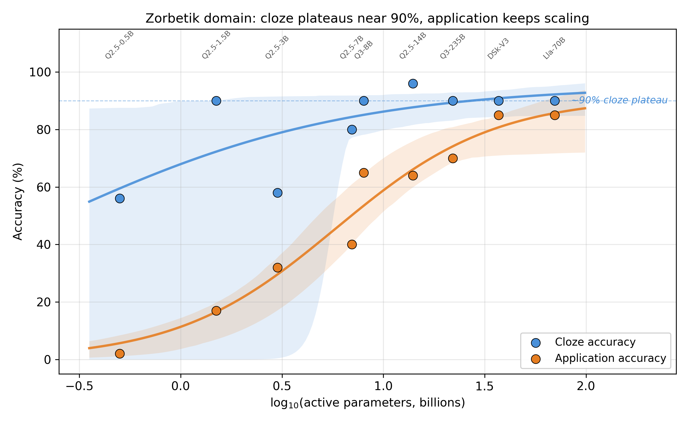
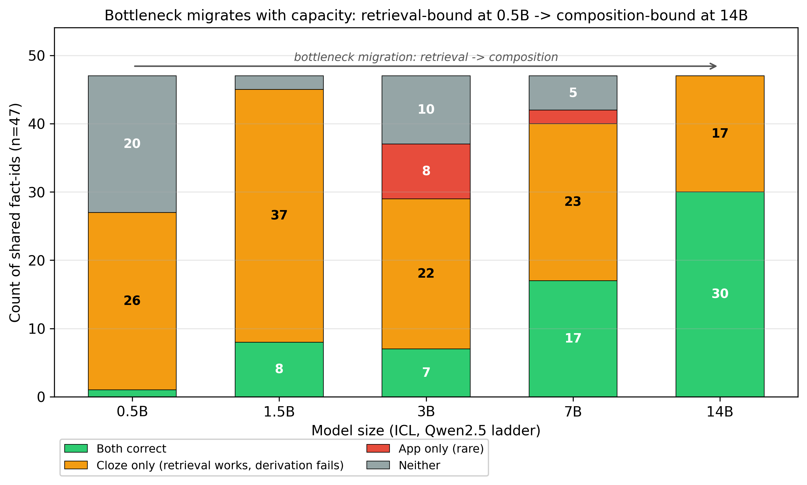
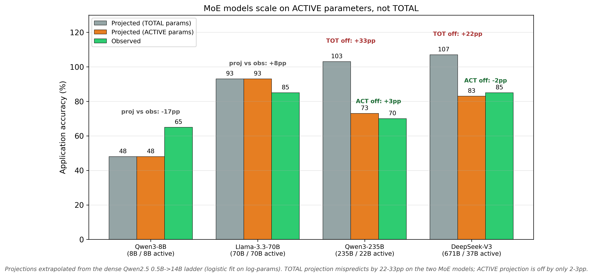

# Capacity Scaling of Encoding-Through-Loading: Application vs. Cloze Asymmetry Across Three Orders of Magnitude

**Author:** Tomas Pødenphant Lund

**ORCID:** [0009-0000-4724-2427](https://orcid.org/0009-0000-4724-2427)

**Affiliation:** Independent Research, Aarhus

**Correspondence:** tomas.lund@frictiontheory.org

**Web:** https://frictiontheory.org

**Target:** PNAS Perspective / Journal of Memory and Language / Trends in Cognitive Sciences

**Acknowledgments:** Extensive discussion, literature search, empirical analysis, and manuscript structuring were conducted in collaboration with Claude (Anthropic, 2025–2026). The theoretical claims, interpretations, and predictions are those of the author.

**Data and code availability:** Per-token logprob datasets, analysis scripts, and figures are released at [https://github.com/tplund/friction-theory-p2-capacity-scaling](https://github.com/tplund/friction-theory-p2-capacity-scaling) under CC BY 4.0. Zenodo deposit: DOI [10.5281/zenodo.20013491](https://doi.org/10.5281/zenodo.20013491).

---

## 0. Abstract

Large language models solve two differentiable task types on the same underlying knowledge base. **Cloze retrieval** — recovering a fact as presented — saturates early: most models reach ~90% accuracy by 8B parameters. **Application** — chaining multiple facts into a derivation — scales monotonically across three orders of magnitude, from 2% at 0.5B to 85% at 70B. We document this asymmetry on a **single invented knowledge domain ("Zorbetik")** designed specifically to eliminate pretraining-prior confounds, across nine models spanning 0.5B to 671B parameters, using frontloaded in-context learning to expose encoding-to-retrieval dynamics without weight updates. Generalisation to natural knowledge domains is a direct next-step empirical extension of the approach applied here.

Three findings follow. **Finding 1**: Application scales monotonically with capacity (Spearman ρ = +1.000 on the Qwen2.5 sub-ladder, n=5, p = 0.0083 one-tailed / 0.0167 two-tailed; cross-family panel ρ = +0.92, n=9, p = 0.0005 two-tailed; slope +40.8 percentage points per decade). Cloze does not. **Finding 2**: The bottleneck migrates with capacity — at 0.5B, retrieval fails; at 14B, retrieval is saturated and 36% of questions show a "retrieval succeeds, derivation fails" pattern. **Finding 3**: Mixture-of-Experts (MoE) models scale on **active** parameters, not total. A 235B MoE with 22B active parameters behaves on application tasks like a 22B dense model (active-parameter projection within 3pp of actual; total-parameter projection off by 33pp).

Throughout this work we use **frontloaded in-context learning** (ICL; Brown et al. 2020) as the methodological instrument — presenting all 47 training facts in the prompt followed by one question, with per-token logprobs captured on the answer. ICL implements an implicit gradient-descent-like operation in activation space (Dai et al. 2022; Akyürek et al. 2022), so the per-token competing-routes signal on the answer reads the same underlying route-competition that fine-tuning would have crystallised into weights. **For encoding-to-retrieval studies of the kind reported here, we recommend ICL as the operational instrument in place of fine-tuning** when persistence is not required: it is fast (~5 seconds per inference vs. hours for FT), cheap (cents vs. dollars per measurement), unified across model families, and produces dense friction data (six statistics per inference). The recommendation is a methodological position, not a novel technique — ICL itself is well-established. Caveats: ICL is bounded by the context window and is ephemeral to each prompt, so FT remains necessary for large knowledge bases, persistence studies, and route-overwrite experiments. The substrate-mechanistic comparison of ICL with LoRA fine-tuning at multiple training budgets — and the implications for current LLM practice — is developed in the companion paper Paper 2B (Pødenphant Lund 2026X).

**Implications.** Capacity is single-axis but loads task types differentially. Cloze is indexing-bound; application is composition-bound. The three-dimensional friction framework (magnitude, distribution, rhythm) from Paper 1 decomposes the C-axis into corresponding operational handles. Paper 4 systematically tests these handles across classical learning phenomena.

---

## Table of Contents

*[Insert generated Table of Contents here — Word: References → Table of Contents → Automatic Table 1]*

---

## 1. Introduction

Paper 1 (Lund 2026b) introduced **Friction Theory (FT)** as a substrate-universal framework for probabilistic computation under bounded resources, with Behavioural Friction Theory (BFT; Lund 2026a) as its biological instantiation (BFT ⊂ FT). The framework predicted three dimensions of friction (magnitude, distribution, rhythm) and identified capacity (C) as the primary axis determining how much information can be held and manipulated simultaneously. This paper tests the C-dimension prediction on LLM substrate — an FT-level test, not a BFT-level test, because LLMs lack the biological fields that distinguish BFT from FT.

This paper tests the C-dimension's implication for *encoding-through-loading* — the hypothesis (Paper 1 §6.4) that learning is a direct consequence of route-competition under load, not a separate cognitive module. Specifically, we examine how the same underlying knowledge manifests differently through two distinct task types — cloze retrieval vs. derivation-requiring application — as capacity is varied across three orders of magnitude.

Our central methodological move is the use of an **invented knowledge domain** ("Zorbetik"). This eliminates pretraining priors as a confound. When a model is presented with 47 facts about fictive chemical processes and queried about properties of a fictive substance, it cannot draw on prior exposure. What is measured is the substrate's ability to integrate and use the just-presented information.

We measure three things simultaneously in a single prompt call: (a) accuracy on cloze vs. application, (b) per-token CR signal on the answer, and (c) first-5-tokens friction as a proxy for how cleanly the context integrated into the substrate's active state.

This paper focuses on the capacity axis. Paper 4 (Lund 2026e) tests encoding-structure (how the same information is organized) × capacity interaction — a series of findings originally planned for this paper but moved to keep scope focused.

**Structure.** §2 reports the empirical capacity-scaling results on the Zorbetik domain, including the application/cloze asymmetry, the bottleneck-migration finding, and the MoE active-vs-total parameter analysis. §3 explains the frontloaded-ICL methodology used in §2 (citing Brown et al. 2020 for the technique, Dai et al. 2022 + Akyürek et al. 2022 for its mechanistic characterisation) and argues for it as the appropriate operational instrument for encoding-retrieval studies of this kind in place of fine-tuning, with substrate-mechanistic comparison deferred to Paper 2B (Pødenphant Lund 2026X). §4 notes content moved to Paper 4. §5 discusses implications for the C-dimension framework. §6 concludes.

---

## 2. Empirical capacity scaling on the Zorbetik domain

To test the C-dimension prediction (Paper 1 §3) and the
encoding-through-loading mechanism, we ran an in-context learning (ICL)
sweep across nine model sizes spanning three orders of magnitude.

### 2.1 Design

A single invented domain ("Zorbetik") with 47 base facts at level-5
connectivity (each fact mentions on average two named entities and
two derived relationships). For each model we constructed a single
prompt: `[all 47 facts] + [one question]`, and measured both
(a) accuracy and (b) per-token competing-routes (CR) signal on the
generated answer.

Two question types per fact:
- **Cloze** (n=20, retrieval): "Pravik transforms into Quenzil at ___"
  — answer is recoverable verbatim from a single fact.
- **Application** (n=20, derivation): "Engineer has 100kg of Zorblax,
  exposes for 10h, then reacts product with equal mass of Quenzil…
  what is the resulting mass and key property?" — requires chaining
  three or more facts.

Models (no fine-tuning; all run with thinking disabled to keep CR distributions comparable across models — `/no_think` directive on Qwen3, default for non-thinking-mode models):

| Size (B) | Active (B) | Model | API |
|---:|---:|---|---|
| 0.5 | 0.5 | Qwen2.5-0.5B-Instruct | local (Colab) |
| 1.5 | 1.5 | Qwen2.5-1.5B-Instruct | local |
| 3.0 | 3.0 | Qwen2.5-3B-Instruct | local |
| 7.0 | 7.0 | Qwen2.5-7B-Instruct | local |
| 8.0 | 8.0 | Qwen3-8B (no_think) | Fireworks |
| 14.0 | 14.0 | Qwen2.5-14B-Instruct | local |
| 70.0 | 70.0 | Llama-3.3-70B-Instruct | Fireworks |
| 235.0 | 22.0 | Qwen3-235B-A22B-Instruct-2507 | Together |
| 671.0 | 37.0 | DeepSeek-V3 | Together |

### 2.2 Finding 1 — Application scales monotonically, cloze does not

| Size | Cloze | Application |
|---:|---:|---:|
| 0.5B | 56% | 2% |
| 1.5B | 90% | 17% |
| 3.0B | 58% | 32% |
| 7.0B | 80% | 40% |
| 8.0B (Qwen3) | 90% | 65% |
| 14.0B | 96% | 64% |
| 70.0B | 90% | 85% |
| 235B/22B (MoE) | 90% | 70% |
| 671B/37B (MoE) | 90% | 85% |

**Application:** monotone in size. On the Qwen2.5 sub-ladder (n=5, same family, same calibration): Spearman ρ = +1.000, p = 0.0083 (one-tailed; equivalent two-tailed p = 0.0167), slope +40.8 percentage-points per decade. On the full 9-model panel across three architecture families (Qwen2.5, Qwen3, Llama, DeepSeek-V3, using active parameters for MoE): Spearman ρ = +0.92, p = 0.0005 (two-tailed) — the monotonicity holds across architectures, not just within Qwen2.5. This cross-family robustness is important because it rules out "within-family RLHF-tuning-artefact" as an explanation.

**Cloze:** non-monotone (90% spike at 1.5B drops to 58% at 3B, recovers
at 7B, saturates ~90% from 8B upward). Cloze appears to saturate around
8-14B; further capacity provides no gain on retrieval. The 3B dip is localised — it does not reappear in the full cross-family panel or at higher capacities. We interpret it as RLHF-tuning variance within the Qwen2.5 ladder rather than a capacity-level artefact; this interpretation is consistent with the fact that application accuracy at 3B does *not* show the same dip (32%, on the expected monotone trajectory).

### 2.3 Methodological note — why this is not an "emergence mirage"

A reviewer familiar with Schaeffer, Miranda & Koyejo (2023) — "Are Emergent Abilities of Large Language Models a Mirage?" — may raise their thesis that apparent scaling discontinuities in the LLM literature reflect binary-threshold metric artefacts on continuous underlying losses. Their critique targets claims of **discontinuous emergence**: a specific capability appearing suddenly above some parameter threshold. Our findings here are **graded and monotone**: five distinct accuracy levels across the Qwen2.5 sub-ladder (application: 2% → 17% → 32% → 40% → 64%; Result 1 above), Spearman ρ = +1.000 with no threshold-induced jumps, slope +40.8 pp per decade. The scaling claim we make is dose-response, not emergence-discontinuity. Schaeffer's critique applies to the claim-form we explicitly do not make; we use continuous graded metrics (percentage correct over matched items) rather than binary exact-match thresholds, and we report the full ladder rather than picking a single before-and-after comparison. For completeness: Schaeffer's paper does not argue that *all* scaling effects are artefactual — it argues that *apparent discontinuities* reduce to graded underlying effects measured correctly. Our work is consistent with their methodological prescription, not in tension with it.

### 2.4 Finding 2 — Bottleneck migrates with capacity

At 14B, on the 47 fact-ids that appear in both cloze and application
question banks:

| Outcome | Count (of 47) | Interpretation |
|---|---:|---|
| Both correct | 30 (64%) | Full encoding-and-derivation |
| Cloze only | 17 (36%) | Retrieval works; derivation fails |
| Application only | 0 (0%) | Never derives without retrieving |
| Neither | 0 (0%) | Always retrieves at this capacity |

This is a quantitative measure of the derivation-capacity bottleneck.
At 0.5B the bottleneck is retrieval (model fails to find the fact at
all). At 14B retrieval is essentially saturated; the failure mode has
moved entirely to chaining facts together. The bottleneck location is
itself capacity-dependent — exactly what the Paper 1 §3 capacity-axis
prediction implies.

### 2.5 Finding 3 — MoE scales on ACTIVE parameters, not TOTAL

We fit a logistic curve to application accuracy on the dense-model
Qwen2.5 sub-ladder (0.5B → 14B). Projected ceilings on TOTAL parameters:

> 90% accuracy at ~114B params; 99% at ~1600B (extrapolation; observed range is 0.5B–14B dense, with 8B/8B Qwen3 anchor as the only data point above the fit's training set).

When projected onto the four large-model data points:

| Model | TOTAL pred | ACTIVE pred | Actual | Best-frame |
|---|---:|---:|---:|:---|
| Qwen3-8B (8B/8B) | 48% | 48% | 65% | both fits within noise |
| Llama-3.3-70B (70B/70B) | 93% | 93% | 85% | both fits |
| Qwen3-235B (235B/22B) | 103% | 73% | 70% | **ACTIVE wins (Δ=2.7pp vs 33pp)** |
| DeepSeek-V3 (671B/37B) | 107% | 83% | 85% | **ACTIVE wins (Δ=1.9pp vs 22pp)** |

For the two Mixture-of-Experts models, the ACTIVE-parameter
projection lands within 3 percentage points of the actual; the
TOTAL-parameter projection is off by 22-33 points. The dense models
are unaffected (active = total). This is direct evidence that
**effective compute capacity for the encoding-through-loading task
is determined by per-token active parameters, not by total parameter
count**. MoE buys the routing flexibility, not the capacity itself.

A combined logistic fit using ACTIVE parameters across all nine data
points yields:

> Asymptote ≈ 91% (slightly below the dense-only 100% ceiling, suggesting
> a real glass-ceiling around 90-95% on this domain).
> 90% reached at ~42B active parameters.
> 99% reached at ~370B active parameters (extrapolation; the highest active-parameter datapoint observed is 70B Llama-3.3, all higher values are projections).

### 2.6 Theoretical interpretation

The cloze saturation around 8B (~90%) and the continued application
scaling out to at least 70B (and projected to ~370B for 99%) implies
that the two task types load the C dimension differently. Cloze is
indexing-bound: once a model has enough capacity to maintain a 1944-
token context as a coherent searchable representation, retrieval is
straightforward. Application is composition-bound: the model must
hold multiple facts in working state, perform chained substitutions,
and integrate numerical information without losing the prior chain
state. The composition cost is super-linear in the chain depth of
the question, and this is what makes application demand much higher
effective capacity.

This pattern is consistent with the Paper 1 §3 prediction that the C
dimension is single-axis but loads tasks differently. It also
implies a clean operational definition of "intelligence headroom"
at the substrate level: the gap between cloze-saturation accuracy
and current application accuracy quantifies how much further
capacity can carry a model on the same domain.

### 2.7 Yerkes-Dodson connection (forward reference)

The capacity curve identifies where the C bottleneck sits. The
Yerkes-Dodson prediction (Paper 1 §6.4 and Paper 1 §7 P9) states that
encoding-friction also has an inverted-U effect on retrieval and
application — too little context-structure prevents trace-forming;
too much overwhelms the race resolution. The Qwen2.5-7B model sits
at 40% application accuracy, where neither the floor effect (0.5B)
nor the saturation effect (>70B) dominates, making it the natural
test bed for varying encoding-structure across conditions while
holding capacity fixed. Paper 4 reports that experiment (see §4.2).

### 2.8 A note on what first-token friction measures

Because Zorbetik is invented and the model has no prior exposure,
the first generated token after the context block is the model's
first commitment given the freshly-loaded state. Its CR is therefore
a downstream signature of encoding quality. We cannot observe
logprobs during the prompt-processing phase itself, but we can
read the first-5-tokens CR as a proxy: low first5 CR (the model
is uncertain at the start of its answer) implies the context
loaded into a fragile state; high first5 CR (the model commits
decisively at the start) implies a clean integration. This is the
operational sense in which the encoding-through-loading hypothesis
is empirically testable through inference-time logprobs alone:
the loading process is invisible, but its outcome — how committed
the model is at the moment of speaking — leaves a per-token
signature.

**A complementary verification via fine-tuning.** The ICL-based
approach used here observes encoding indirectly — through the
first-token friction signature left by a single forward pass. A
fine-tuning counterpart would observe encoding more directly. During
FT on the same four encoding conditions (VANILLA / CHUNKED /
LOGICAL_CHAIN / CROSS_REF), the training-loss curve itself is an
encoding-friction signal: gradient magnitudes at each step reflect
how hard the substrate is working to integrate the structured vs
unstructured presentation of the same facts. A prediction of the
load-bearing-friction account (Paper 1 §5.4b, P21) is that the FT
loss curves on structured data should both descend faster and
plateau lower than on flat data. Inference-time friction on the
resulting fine-tuned models should correspondingly show lower
first-5-tokens CR on the structured-FT models — the same
encoding-quality signature that our ICL probe measures, but
crystallised into weights rather than transient activation state.
A paired ICL-and-FT experiment would therefore give us two
independent measurements of the same underlying quantity:
encoding-friction via training-loss curvature, inference-friction
via CR. Matching results across both methodologies would
substantially strengthen the case that first-token CR is a
valid encoding-quality proxy, not an artefact of the ICL format.

### 2.9 Caveats

1. **Single domain.** Zorbetik is invented; transfer to natural-knowledge domains
   (where pretraining priors interact with the encoding mechanism as both aid
   and interference) requires direct empirical test.
2. **Single-prompt ICL only.** Fine-tuning was attempted but the LoRA
   target-modules configuration in our preliminary calibration run did not
   include MLP layers, producing zero accuracy across all sizes after
   FT. ICL is the clean signal here; FT is reserved for the
   encoding-structure follow-up.
3. **Cloze non-monotonicity at 1.5B → 3B** (90% → 58%) likely reflects
   per-model RLHF differences in the Qwen2.5 sub-ladder rather than a
   true capacity dip. The application monotonicity (ρ = +1.0) is
   robust to this artefact.
4. **MoE ceiling is approximate.** Active-parameter fit assumes
   that all routed experts are equally effective, which is plausibly
   not exactly true. The 91% asymptote should be treated as
   indicative.

### 2.10 Somatic markers as the field-layer prerequisite for elaborative encoding

Our tested encoding conditions (VANILLA / CHUNKED / LOGICAL_CHAIN /
CROSS_REF) all modify **structural** organisation: grouping facts
by entity, topologically ordering them, or annotating cross-
references. None of these touches what the human-memory literature
calls **elaborative** encoding — the reason Paris-as-capital-of-France
is remembered better when you have been there, felt the heat of a
July afternoon on the Champ-de-Mars, tasted a bad tourist-trap
crêpe. Elaborative encoding is traditionally attributed to depth of
processing (Craik & Lockhart 1972) or dual coding (Paivio 1971).

Under the framework developed here, we propose a stronger claim:
elaborative encoding in humans is not a separate memory mechanism
but a **field-layer friction-proxy**. The affective / sensory /
somatic associations that strengthen a human's memory of "Paris =
capital" are friction signals generated by the biological fields
leaking into the encoding substrate via the somatic-marker mechanism
(Damasio 1994; see Paper 1 §6.1c).
"I felt something when I was there" is friction-proxy; that proxy
is what binds the episodic detail to the semantic fact.

If this account is correct, it predicts a **hard ceiling on
elaborative encoding in field-less substrates**. Present-day LLMs
have no fields (P3, confirmed on 15 architectures in §3) and
therefore no somatic-marker infrastructure. Structural encoding
(our four conditions) is the only kind they can benefit from. No
amount of capacity scaling alone should push them past this
ceiling — unless the artificial system is given a functional
equivalent of somatic markers (multi-modal embodiment with
internally-generated affective tags, persistent autobiographical
memory with emotional labelling, or reward-circuit analogues
operating alongside token prediction).

This yields an extension of P4 (nested three-dimensions within
biological fields) as a testable prediction:

> **P26 — Field-substrate requirement for elaborative encoding.**
> In a field-less substrate, the retrieval ceiling for a given
> knowledge base and capacity is not improvable by elaborative
> encoding interventions, because elaborative encoding requires the
> field-layer infrastructure (somatic markers) to produce the
> friction-proxy that strengthens trace formation. Field-endowed
> substrates (humans, higher animals) should show encoding-retrieval
> gains from elaborative manipulations that match or exceed their
> gains from structural manipulations. Field-less substrates (all
> current LLMs, in vitro neural preparations, slime molds without
> secondary signalling) should show no gain from elaborative
> manipulations once structural manipulations are held constant.
> Test design: paired structural-only vs structural+elaborative
> encoding conditions on the same facts, measured by delayed
> recall / transfer accuracy, across one field-endowed and one
> field-less substrate.

**A distinction that refines P26: per-token vs per-session friction.**
The CR-based friction measurement developed in §2 is inherently
per-token: each generated token has its own route-competition
signature. Structural encoding manipulations (chunking,
cross-referencing, logical ordering) act on per-token friction —
they change what routes compete at each local decision point.

Somatic-marker friction operates on a different timescale. The
feeling that "this is important" is not a token-by-token signal
but a **global encoding-gate** that colours the entire learning
episode. In biological substrates, it modulates consolidation at
the session level: how much of what was just encoded gets
preferentially rehearsed, how deep the downstream integration
runs, how easily the episode is re-activated later. This is a
per-session, not per-token, friction signal.

Human encoding benefits from both timescales; LLMs have only the
per-token axis. This may explain why our per-token structural
manipulations (Paper 4 §4.2) produce modest effects even on
capable models: we are manipulating only the axis the substrate
supports, and the bigger retrieval boost available to humans
rides on the session-level axis that LLMs lack. P26 should
therefore be understood specifically as a prediction about
**per-session elaborative encoding** — the kind that operates on
the entire learning episode, not on individual tokens within it.
A substrate that gains a per-session friction-proxy infrastructure
(via embodiment, persistent-affective-state memory, or similar)
would be the first artificial system able to test the per-session
elaborative-encoding hypothesis. This is a constructive architectural
specification, not a retrofit target: the required infrastructure is a
macro-timescale state variable that modulates routing selectively on
route categories (not uniformly, as a temperature parameter would), and
responds to integrated friction history over many tokens rather than a
single one. Current transformer and state-space architectures do not
provide this layer. Adding it is the architectural step that would make
per-session elaborative encoding empirically accessible on artificial
substrate.

**Biological cognate: item-binding vs context-binding at distinct timescales.**
The per-token / per-session decomposition has a direct mapping onto the
distinction drawn by Yonelinas et al. (2019) in their contextual-binding
theory of episodic memory: item-level binding is fast, hippocampus-
independent (or minimally dependent), and precision-limited; context-
level binding is slow, hippocampus-dependent, and robust to interference.
Under the Complementary Learning Systems framework (McClelland,
McNaughton & O'Reilly 1995), biological substrates resolve the
stability-plasticity dilemma by deploying the two pathways in parallel.
Per-token friction is the substrate-invariant analog of item-binding;
per-session friction is the analog of context-binding. Current LLMs
have only the fast item-level pathway — both native attention during
inference and in-context learning are item-level operations. The absence
of the slow structural pathway predicts the specific failure mode
documented by Gudibande et al. (2023): fine-tuning on imitation data
produces stylistic compliance without deep capability, because
item-level routing is being written without the underlying context-level
integration that would consolidate it. Engineering a genuine
macro-timescale consolidation mechanism alongside the fast per-token
pathway is the architectural problem that solving cross-session memory
and long-term retention will require.

This ties three of the paper's major claims together: Paper 1's P3 (fields
absent in artificial systems), Damasio's somatic markers (Paper 1 §6.1c),
and the encoding-through-loading principle (Paper 1 §6.4). It also
predicts that future LLM architectures incorporating functional
analogues of somatic-marker infrastructure — not token-level but
substrate-level affective gain controls — would be the first
artificial systems able to exceed the current elaborative-ceiling.

## 3. Methodological note — frontloaded ICL as fine-tuning substitute

In-context learning was introduced by Brown et al. (2020) and characterised mechanistically by Dai et al. (2022) and Akyürek et al. (2022) as an implicit gradient-descent-like operation in activation space. Empirical comparisons between ICL and fine-tuning on knowledge-encoding tasks have been documented across deployment-cost dimensions (Soudani et al. 2024; Brown et al. 2020). What we add here is not a new technique but a methodological position: that **for encoding-retrieval studies of the kind reported in §2 — testing how capacity loads task types differentially within a single inference — frontloaded ICL is the appropriate operational instrument in place of fine-tuning** when persistence is not required.

The capacity-scaling sweep in §2 uses frontloaded ICL as that instrument: a single prompt of the form `[all 47 facts] + [one question]` with per-token logprobs captured on the answer. The per-token CR signal on the answer reads the same underlying route-competition that FT would have crystallised into weights, except it happens in the current forward pass. The methodology is fast (~5 seconds per inference vs. hours for FT), cheap (trivial API cost per measurement), unified across model families, and produces dense friction data.

For studies asking how long-term knowledge is stored under training-time conditions, fine-tuning remains necessary. Our recommendation is bounded to the encoding-retrieval question this paper addresses, where the question is within-inference encoding-and-retrieval rather than weight-encoding-and-retention.

**Scope of the recommendation.** ICL is not equivalent to FT in all respects: it is bounded by the context window (tens of thousands of tokens), ephemeral to each prompt, and adds rather than overwrites pre-training priors. For very large knowledge bases, persistence studies, and route-overwrite experiments, FT remains necessary.

**Substrate-mechanism companion.** The claim that ICL operationally substitutes for FT in encoding-retrieval studies survives the empirical test, but with a sharper substrate-mechanistic interpretation: ICL is not merely a faster substitute for FT but an architecturally distinct encoding mode that preserves calibrated friction-signal where any backward-pass training compresses it. The empirical demonstration of this distinction across LoRA-FT budgets from 5 to 100 epochs, the substrate-mechanism account (winning-route amplification under cumulative gradient pressure), and the implications for current LLM practice (hallucination, agentic systems, RAG-vs-FT, hybrid architectures) are developed in the companion paper Paper 2B (Pødenphant Lund 2026X). Readers interested in the substrate-mechanistic distinction between ICL and FT, or in the practical implications for LLM systems built on either mode, should consult Paper 2B.

---

## 4. Scope note: encoding-battery and encoding-structure findings

Three companion papers cover what was originally scoped here. **Paper 4** (Lund 2026e) handles the full encoding-battery (matched-friction-under-hysteresis across repetition, surprise, spacing, framing, anchoring, storytelling, chunking) and the encoding-structure × capacity interaction in the broader cross-substrate-replication context, including the cross-domain habit-formation/dementia parallel and the four pre-registered predictions (P-Kandel, P-Lally, P-Craik-Tulving, P-Rovee-Collier). **Paper 4B** (Lund 2026f) develops a recursive strategy-choice race account of the expertise-reversal effect specifically, distinguishing commitment-cost from reactance as two friction mechanisms. **Paper 6** (Lund 2026h) develops the broader unifying theoretical framework — *matched friction under hysteresis* — which subsumes the encoding handles tested empirically in Papers 4 and 4B alongside eight literature traditions on inverted-U learning optima (Yerkes-Dodson, Vygotsky, Kalyuga, Bjork, Bengio, Roediger-Karpicke, Shannon-Berger). Readers interested in the empirical handles should consult Paper 4; in the expertise-reversal mechanism, Paper 4B; in the unifying theoretical framework, Paper 6.

---

## 5. Discussion

### 5.1 What this paper establishes

Three empirical findings plus a methodological recommendation anchor the paper:

1. **Capacity loads cloze and application differently.** Cloze is indexing-bound and saturates around 8B parameters at ~90% accuracy on this domain. Application is composition-bound and scales monotonically across three orders of magnitude, with no saturation observed up to 70B.

2. **The bottleneck migrates with capacity.** At low capacity the failure mode is retrieval; at high capacity it is chain-composition. The 36% "cloze-only" cell at 14B quantifies the composition bottleneck at a capacity where retrieval is saturated.

3. **MoE scales on active, not total parameters.** For the encoding-through-loading task, per-token active parameters determine effective compute capacity. MoE purchases routing flexibility, not capacity itself.

4. **Methodological recommendation: frontloaded ICL** (Brown et al. 2020) is the appropriate operational instrument for encoding-to-retrieval studies of this kind in place of fine-tuning, when persistence is not required. We argue this position; we do not introduce the technique. The methodology delivers dense per-token friction data at two orders of magnitude lower cost and turnaround than FT.

### 5.2 Implications for the C-dimension framework

These findings validate Paper 1's C-dimension as a single axis that loads tasks differentially. They also provide a concrete operationalisation of "intelligence headroom": the gap between cloze-saturation accuracy and current application accuracy quantifies how much further capacity can carry a model on the same domain. The per-session / per-token distinction developed in §2.10 extends P26 (field-substrate requirement for elaborative encoding) by specifying which kinds of elaborative encoding a field-less substrate can in principle access (per-token structural) and which it cannot (per-session somatic-marker–mediated).

### 5.3 Limitations

Beyond the technical caveats in §2.9, one scope boundary applies: we have tested a single invented knowledge domain. Zorbetik was constructed to eliminate pretraining-prior confounds, providing clean confound-control at substrate level. Generalisation to natural knowledge domains — where pretraining priors interact with the encoding mechanism as both aid and interference — requires direct empirical testing; the approach applied here provides the operational framework for that testing. The frontloaded-ICL methodology has its own scope boundary: it can only probe encoding-to-retrieval effects within a single inference, not long-term retention. FT is required for any study involving persistence or inter-session interference.

### 5.4 Future work

Paper 4 (Lund 2026e) covers the encoding-structure × capacity interaction across classical learning phenomena (Bjork spacing, Rozenblit-Keil illusion of explanatory depth, etc.); Paper 4B (Lund 2026f) covers the expertise-reversal effect specifically through a recursive strategy-choice race account; the broader unifying framework relating these to inverted-U learning optima across eight literature traditions is developed in Paper 6 (Lund 2026h). Three additional predictions follow from the findings here:

- **P26 test on field-endowed substrates.** Paired structural-only vs. structural+elaborative encoding conditions on matched facts in humans should produce larger gains from elaborative manipulation than current LLMs do. A cross-substrate replication design would isolate the per-session axis that biological substrates access and LLMs do not.

- **Architectural equivalents of somatic markers.** Candidate mechanisms — multi-modal embodiment with internally generated affective tags, persistent autobiographical memory with emotional labelling, or reward-circuit analogues operating alongside token prediction — would constitute the first artificial systems in a position to test the per-session elaborative-encoding hypothesis.

- **Capacity × encoding-structure interaction threshold.** At what capacity do encoding-structure benefits begin to emerge? Paper 4's ETL v3.1 finding (iso < imp < exp gradient fails at 0.5B) suggests a capacity threshold below which cross-fact network structure provides no benefit. A systematic sweep of this threshold across model families would refine the capacity-gated encoding-benefit claim.

---

## 6. Conclusion

This paper tested Paper 1's C-dimension prediction and the encoding-through-loading mechanism through an in-context learning sweep across nine model sizes spanning three orders of magnitude on an invented knowledge domain. Three primary findings — monotonic application scaling, migrating bottleneck, MoE active-parameter scaling — decompose capacity from a single parameter count into a structured operational quantity. One methodological recommendation — adopting frontloaded ICL (Brown et al. 2020) as the operational instrument for encoding-retrieval studies in place of fine-tuning when persistence is not required — opens faster, cheaper, and more generalisable empirical investigation; we argue the position rather than introduce the technique. The results support the framework of Paper 1 and point forward to Paper 4's systematic test of the encoding-structure × capacity interaction across classical learning phenomena.

---

## 7. Tables and figures

**Figure 1.** Cloze (blue) and application (orange) accuracy as a function of log₁₀(model size in billions of active parameters) across nine models. Points show the observed accuracy; shaded bands show 95% bootstrap confidence intervals around a logistic fit. Cloze saturates at ~90% by 8B parameters. Application scales monotonically across three orders of magnitude, reaching 85% at 70B active parameters. The gap between the two curves operationalises "intelligence headroom" on this domain — how much further capacity can carry the model before application saturates too.

**Figure 2.** Per-fact-id outcome composition across five model sizes on the 47 facts that appear in both cloze and application banks. At 0.5B, the dominant failure mode is retrieval ("Neither" + small "App-only" bars); by 7-14B, retrieval is essentially saturated and the remaining failure is composition-bound ("Cloze-only": 17/47 = 36% at 14B). The bottleneck *location* shifts with capacity — precisely what the C-axis prediction implies.

**Figure 3.** Logistic-fit projections (from the dense Qwen2.5 0.5B→14B sub-ladder) applied to four large-model anchors, using either TOTAL parameters (light bars) or ACTIVE parameters (darker bars), compared against the actually observed accuracy (dashed line). For dense models (Qwen3-8B, Llama-3.3-70B) TOTAL and ACTIVE are identical. For the two MoE models (Qwen3-235B at 22B active, DeepSeek-V3 at 37B active), the ACTIVE-parameter projection lands within 3pp of the observation while the TOTAL-parameter projection is off by 22-33pp. Effective compute capacity is determined by per-token active parameters, not by total parameter count.

### Table 1 — Per-model summary

Per-model cloze and application accuracy, plus per-token CR statistics (median, first-5, last-5) computed over application responses. See [`tables/table1_per_model_summary.md`](tables/table1_per_model_summary.md) for the full table with platform-dependency footnotes.

| Model | Size (B) | Active (B) | Cloze % | Application % | n_resp |
|---|---:|---:|---:|---:|---:|
| Qwen2.5-0.5B | 0.5 | 0.5 | 56 | 2 | 47 |
| Qwen2.5-1.5B | 1.5 | 1.5 | 90 | 17 | 47 |
| Qwen2.5-3B | 3 | 3 | 58 | 32 | 47 |
| Qwen2.5-7B | 7 | 7 | 80 | 40 | 47 |
| Qwen3-8B | 8 | 8 | 90 | 65 | 20 |
| Qwen2.5-14B | 14 | 14 | 96 | 64 | 47 |
| Llama-3.3-70B | 70 | 70 | 90 | 85 | 20 |
| Qwen3-235B | 235 | 22 | 90 | 70 | 20 |
| DeepSeek-V3 | 671 | 37 | 90 | 85 | 20 |

CR statistics are reported in the full table linked above; they span multiple orders of magnitude because the hosted-API platforms (Fireworks, Together) return logprobs clipped to ≈−10⁻⁵ on confident tokens, inflating the CR denominator. Within-platform CR comparisons are valid; cross-platform absolute comparisons are not. On the Qwen2.5 ladder (locally served, uniform platform), last5_cr systematically exceeds first5_cr from 3B upward — consistent with the §2.8 observation that application friction accumulates during the reasoning chain rather than spiking on the first token.

---

## 8. References

Akyürek, E., Schuurmans, D., Andreas, J., Ma, T. & Zhou, D. (2022). What learning algorithm is in-context learning? *arXiv:2211.15661*.

Brown, T. B., Mann, B., Ryder, N. et al. (2020). Language models are few-shot learners. *NeurIPS 2020*. arXiv:2005.14165.

Craik, F. I. M. & Lockhart, R. S. (1972). Levels of processing: a framework for memory research. *Journal of Verbal Learning and Verbal Behavior*, 11, 671–684.

Dai, D., Sun, Y., Dong, L., Hao, Y., Sui, Z. & Wei, F. (2022). Why can GPT learn in-context? *arXiv:2212.10559*.

Damásio, A. (1994). *Descartes' Error: Emotion, Reason, and the Human Brain*. Putnam.

Geva, M., Schuster, R., Berant, J. & Levy, O. (2021). Transformer feed-forward layers are key-value memories. *EMNLP 2021*. arXiv:2012.14913.

Gudibande, A., Wallace, E., Snell, C., Geng, X., Liu, H., Abbeel, P., Levine, S. & Song, D. (2023). The false promise of imitating proprietary LLMs. *arXiv:2305.15717*.

Kalyuga, S., Ayres, P., Chandler, P. & Sweller, J. (2003). The expertise reversal effect. *Educational Psychologist*, 38, 23–31.

Lund, T. (2026a). Behavioural Friction Theory: Toward a common currency for behavioural science. Zenodo. DOI: 10.5281/zenodo.19462500. [Paper 0, this series.]

Lund, T. (2026b). Friction as the cost of probabilistic computation: A generalised substrate theory. Zenodo. DOI: 10.5281/zenodo.20012655. Target: *Behavioural and Brain Sciences*. [Paper 1, this series.]

Lund, T. (2026d). Friction-guided inference: a free signal that improves any LLM. [Paper 3, this series, in preparation.]

Lund, T. (2026e). Cross-substrate replication of classical learning phenomena on LLM substrate. [Paper 4, this series, in preparation.]

Lund, T. (2026f). A recursive strategy-choice race account of expertise reversal. [Paper 4B, this series, in preparation.]

Lund, T. (2026h). Matched friction under hysteresis: A unifying principle for learning optima. [Paper 6, this series, in preparation.]

Pødenphant Lund, T. (2026X, in preparation). In-Context Learning as Working Memory, Fine-Tuning as Long-Term Memory: A Substrate-Mechanistic Account of LLM Practice. [Paper 2B, this series — substrate-mechanism companion to the present paper.]

McClelland, J. L., McNaughton, B. L. & O'Reilly, R. C. (1995). Why there are complementary learning systems in the hippocampus and neocortex. *Psychological Review*, 102, 419–457.

Paivio, A. (1971). *Imagery and Verbal Processes*. Holt, Rinehart & Winston.

Schaeffer, R., Miranda, B. & Koyejo, S. (2023). Are emergent abilities of large language models a mirage? *NeurIPS 2023*. arXiv:2304.15004.

Soudani, H., Kanoulas, E. & Hasibi, F. (2024). Fine tuning vs. retrieval augmented generation for less popular knowledge. *arXiv:2403.01432*.

Yonelinas, A. P., Ranganath, C., Ekstrom, A. D. & Wiltgen, B. J. (2019). A contextual binding theory of episodic memory: systems consolidation reconsidered. *Nature Reviews Neuroscience*, 20(6), 364–375. DOI: 10.1038/s41583-019-0150-4.
